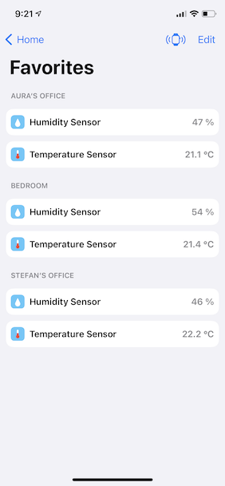

# Mijia Hub
_Stefan Arentz, April 2021_

This is a small program that you can run on a device like a Raspberry Pi Zero that will make LYWSD03MMC Temperature/Humidity sensors with custom firmware available on your local network as HomeKit accessories.


The LYWSD03MMC Temperature/Humidity sensors are pretty cheap. If you don't mind longer shipping times, you can usually get them pretty cheap. (Right now [Gearbest](https://www.gearbest.com/thermometers/pp_3007525396195461.html?wid=2000001&lkid=80900118) has a deal for 4 sensors for $15 USD, which is a steal.)

For this to work you need to flash the LYWSD03MMC sensors with the custom firmware from [github.com/atc1441/ATC_MiThermometer](https://github.com/atc1441/ATC_MiThermometer). Don't worry, this is easy - no soldering required - you can just install this firmware through a browser.

# Installing

The current release is [v0.1.0](https://github.com/st3fan/mijia-hub/releases/tag/v0.1.0).

The easiest way to get going with this is to download the attached .deb file and install it on a Raspberry Pi Zero W. If you have a device that is a different architecture, please file a bug and I will update the build scripts to generate the proper packages.

```
$ wget https://github.com/st3fan/mijia-hub/releases/download/v0.2.0/mijia-hub_0.2.0_armhf.deb
$ sudo dpkg --install mijia-hub_0.1.0_armhf.deb
```

The default PIN for new devices is `122334455`. You can change this in `/etc/default/mijia-hub`:

```
# Pin used to pair devices. The same pin is used for all
# devices. Must be 8 digits.

PIN="12233445"
```

Finally, start the `mijja-hub` daemon with:

```
$ sudo systemctl start mijia-hub
```

# Setting up Sensors

Follow the instructions on [github.com/atc1441/ATC_MiThermometer](https://github.com/atc1441/ATC_MiThermometer). I was able to setup all my sensors through the web-based flasher at [atc1441.github.io/TelinkFlasher.html](https://atc1441.github.io/TelinkFlasher.html). Unfortunately this only works in Chrome since Firefox does not support the _WebBlueTooth_ APIs.

The following settings are important:

 * Set the _Advertising Type_ to _Custom_.
 * To be gentle on the battery, set the _Advertising Interval_ to 5 or 10 minutes.

That is all you need on the sensor side.

# Operation

Once the `mijia-hub` is running on your device, it will listen on Bluetooth LE for sensors to advertise the temperature. Right now any sensor in range will be added, so if your neighbours are using these sensors with the same custom firmware, you'll be able to see those too. I don't have anyone else in range, so I did not care about adding an allow-list to the `mijia-hub` configuration - but if this is important to you, please file an issue.

The following two screenshots are from the [Home+](https://hochgatterer.me/home/) application, which is an excellent replacement for Apple's _Home.app_.

  
